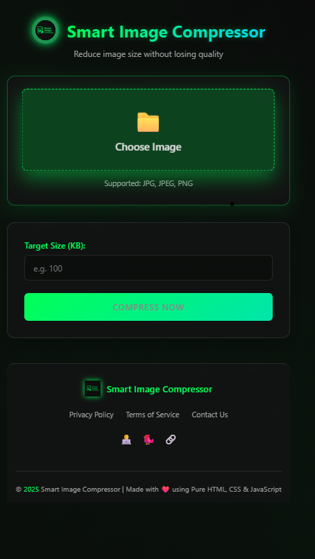

# Smart Image Compressor 🖼️➡️📦

A modern web tool to compress images to specific file sizes with precision. Perfect for optimizing web assets while maintaining control over output quality.

 *(Optional: Add screenshot later)*

## Features ✨

✅ **Precise Size Control** - Compress to exact KB targets  
✅ **Smart Compression** - Auto-adjusts quality & dimensions  
✅ **Format Conversion** - PNG → JPEG for better compression  
✅ **Visual Feedback** - Before/after comparison  
✅ **Mobile-Friendly** - Works on all devices  
✅ **No Dependencies** - Pure HTML/CSS/JS  

## How It Works ⚙️

1. Upload image (JPG/PNG)  
2. Set target size in KB  
3. Algorithm performs:  
   - Quality reduction (0.9 → 0.1)  
   - Resolution scaling (if needed)  
   - 20-iteration limit for safety  
4. Download optimized image  

## Technical Highlights 💻

```javascript
// Smart compression logic
while (iterations < 20) {
  // Reduce quality first
  if (quality > 0.1) quality -= 0.05;
  
  // Then scale dimensions
  else {
    width = Math.max(50, width * 0.9);
    height = Math.max(50, height * 0.9);
  }
  
  // Check if target reached
  if (sizeKB <= targetSizeKB) break;
}